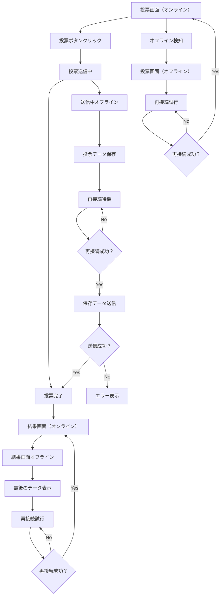
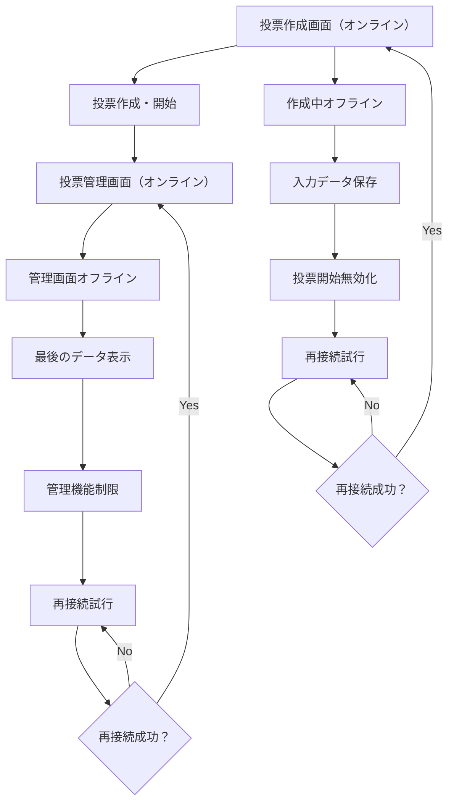
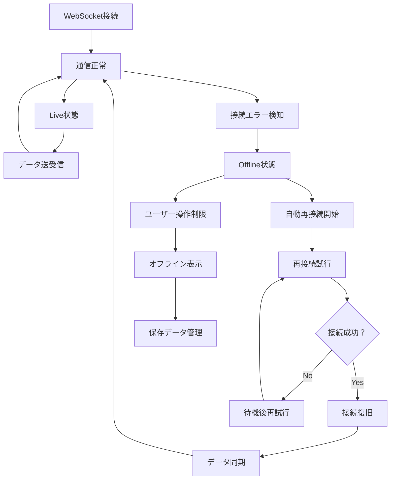

# オフライン時の状態遷移図

## 投票参加者の状態遷移

## 投票作成者の状態遷移

## 共通システム状態

## 状態別の動作

### Online状態（WebSocket + Redis接続成功）
- 全機能利用可能
- Redis Pub/Subによるリアルタイム更新
- 緑色インジケータ
- WebSocket経由でのRedis操作

### Offline状態（WebSocket切断）
- 機能制限（投票不可、結果表示のみ）
- 最後のデータ表示（LocalStorage）
- 赤色インジケータ
- Redis操作不可

### Reconnecting状態（WebSocket再接続中）
- 自動再接続中
- 黄色インジケータ（点滅）
- 操作一時無効
- LocalStorageデータ準備

### Error状態（Redis接続失敗）
- WebSocket接続成功でもRedis処理失敗
- エラーメッセージ表示
- 手動再試行可能
- 橙色インジケータ

### Sync状態（再接続後データ同期）
- Redis TTLによる投票時間確認
- Redis SCARDによる参加者数更新
- Redis HGETALLによる投票結果更新
- LocalStorageデータとRedisデータの整合性確認