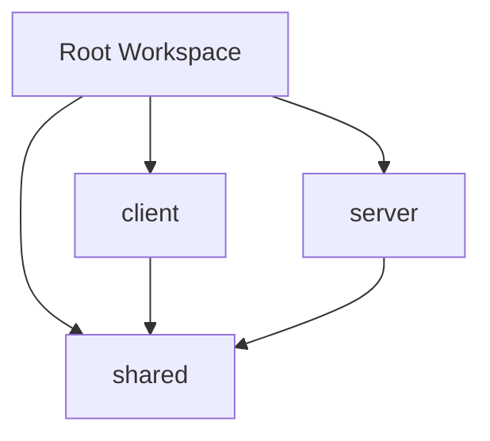

# 技術仕様書

## 1. 技術スタック選択理由

### Runtime & Package Manager
**Bun**
- 高速なJavaScript runtime（Node.jsより高速）
- 内蔵パッケージマネージャー
- TypeScript ネイティブサポート
- WebSocket サポート

### Backend Framework
**Hono**
- 軽量・高速なWebフレームワーク
- TypeScript ファーストの設計
- 豊富なミドルウェア生態系
- WebSocket アップグレード対応

### Frontend Framework
**React 19**
- 最新のConcurrent Features
- Server Components対応
- 成熟した生態系
- TypeScript優秀なサポート

**Vite**
- 高速な開発サーバー
- 効率的なバンドル
- HMR（Hot Module Replacement）
- TypeScript & React最適化

### UI Framework
**TailwindCSS + shadcn/ui**
- ユーティリティファーストCSS
- 高品質なコンポーネント
- アクセシビリティ対応
- カスタマイズ性

## 2. プロジェクト構成

### Monorepo構成
```
bhvr-ws/
├── client/          # React frontend
├── server/          # Hono backend
├── shared/          # 共通型定義
├── doc/             # 設計書
└── package.json     # Workspace設定
```

### パッケージ依存関係


### 型安全性の確保
- 全パッケージでStrict TypeScript
- 共有型による型安全なAPI通信
- Path aliasによる明確な依存関係

## 3. パフォーマンス要件

### レスポンス時間
| 機能 | 目標値 | 測定方法 |
|------|--------|----------|
| WebSocket接続 | < 1秒 | 接続確立時間 |
| 投票送信 | < 500ms | RTT測定 |
| 結果更新 | < 200ms | UI更新時間 |
| ページロード | < 3秒 | LCP測定 |

### スケーラビリティ
- 同時接続数: 100ユーザー（MVP）
- メモリ使用量: < 512MB
- CPU使用率: < 70%

### 最適化戦略
```typescript
// WebSocket接続プール管理
class ConnectionPool {
  private connections = new Map<string, WebSocket>();
  private maxConnections = 100;
  
  addConnection(sessionId: string, ws: WebSocket) {
    if (this.connections.size >= this.maxConnections) {
      throw new Error('Max connections reached');
    }
    this.connections.set(sessionId, ws);
  }
  
  removeConnection(sessionId: string) {
    this.connections.delete(sessionId);
  }
  
  broadcast(event: string, data: any) {
    this.connections.forEach(ws => {
      if (ws.readyState === WebSocket.OPEN) {
        ws.send(JSON.stringify({ event, data }));
      }
    });
  }
}
```

## 4. データ管理戦略

### メモリストレージ（MVP）
```typescript
// インメモリーデータストア
class InMemoryStore {
  private polls = new Map<string, Poll>();
  private votes = new Map<string, Vote[]>();
  private users = new Map<string, User>();
  
  // 投票データの効率的な管理
  getPoll(id: string): Poll | undefined {
    return this.polls.get(id);
  }
  
  addVote(vote: Vote): void {
    const existingVotes = this.votes.get(vote.pollId) || [];
    existingVotes.push(vote);
    this.votes.set(vote.pollId, existingVotes);
  }
  
  // 投票結果の集計
  aggregateVotes(pollId: string): PollOption[] {
    const poll = this.polls.get(pollId);
    const votes = this.votes.get(pollId) || [];
    
    return poll?.options.map(option => ({
      ...option,
      votes: votes.filter(v => v.optionId === option.id).length,
      percentage: (votes.filter(v => v.optionId === option.id).length / votes.length) * 100
    })) || [];
  }
}
```

### 将来の永続化戦略
- **Phase 2**: SQLite による軽量な永続化
- **Phase 3**: PostgreSQL + Redis による本格運用

## 5. WebSocket通信仕様

### 接続管理
```typescript
// WebSocket接続ハンドラー
class WebSocketHandler {
  private connections = new ConnectionPool();
  
  async handleConnection(ws: WebSocket, sessionId: string) {
    // 接続登録
    this.connections.addConnection(sessionId, ws);
    
    // ハートビート設定
    const heartbeat = setInterval(() => {
      if (ws.readyState === WebSocket.OPEN) {
        ws.ping();
      }
    }, 30000);
    
    // 切断処理
    ws.on('close', () => {
      clearInterval(heartbeat);
      this.connections.removeConnection(sessionId);
    });
  }
}
```

### イベント駆動アーキテクチャ
```typescript
// イベント処理システム
class EventBus {
  private listeners = new Map<string, Function[]>();
  
  on(event: string, handler: Function) {
    const handlers = this.listeners.get(event) || [];
    handlers.push(handler);
    this.listeners.set(event, handlers);
  }
  
  emit(event: string, data: any) {
    const handlers = this.listeners.get(event) || [];
    handlers.forEach(handler => handler(data));
  }
}
```

## 6. エラーハンドリング戦略

### エラー分類
1. **ネットワークエラー**: 接続断、タイムアウト
2. **バリデーションエラー**: 不正な入力値
3. **システムエラー**: メモリ不足、内部エラー
4. **ビジネスロジックエラー**: 重複投票、無効な投票

### エラーハンドリング実装
```typescript
// 統一エラーハンドラー
class ErrorHandler {
  static handle(error: Error, context: string) {
    // ログ出力
    console.error(`[${context}] ${error.message}`, error.stack);
    
    // エラータイプ判定
    if (error instanceof ValidationError) {
      return { type: 'validation', message: error.message };
    }
    
    if (error instanceof NetworkError) {
      return { type: 'network', message: 'Connection failed' };
    }
    
    // 一般的なエラー
    return { type: 'system', message: 'An unexpected error occurred' };
  }
}
```

### フロントエンドエラー処理
```typescript
// React Error Boundary
class VotingErrorBoundary extends React.Component {
  constructor(props: any) {
    super(props);
    this.state = { hasError: false, error: null };
  }
  
  static getDerivedStateFromError(error: Error) {
    return { hasError: true, error };
  }
  
  componentDidCatch(error: Error, errorInfo: React.ErrorInfo) {
    console.error('Voting system error:', error, errorInfo);
  }
  
  render() {
    if (this.state.hasError) {
      return <ErrorFallback error={this.state.error} />;
    }
    
    return this.props.children;
  }
}
```

## 7. セキュリティ仕様

### 入力値検証
```typescript
// バリデーション関数
const validatePollCreation = (data: any): ValidationResult => {
  const errors: string[] = [];
  
  if (!data.title || data.title.trim().length < 3) {
    errors.push('Title must be at least 3 characters');
  }
  
  if (!data.options || data.options.length < 2) {
    errors.push('At least 2 options required');
  }
  
  return { isValid: errors.length === 0, errors };
};
```

### WebSocket セキュリティ
- Origin検証
- Rate limiting
- セッションベースの認証
- 入力値のサニタイズ

## 8. 監視・ログ設計

### ログレベル
- **DEBUG**: 開発時のデバッグ情報
- **INFO**: 一般的な動作ログ
- **WARN**: 警告レベルの問題
- **ERROR**: エラー発生時

### メトリクス収集
```typescript
// パフォーマンスメトリクス
class Metrics {
  private static instance: Metrics;
  private counters = new Map<string, number>();
  private timers = new Map<string, number>();
  
  static getInstance(): Metrics {
    if (!Metrics.instance) {
      Metrics.instance = new Metrics();
    }
    return Metrics.instance;
  }
  
  incrementCounter(name: string, value: number = 1) {
    const current = this.counters.get(name) || 0;
    this.counters.set(name, current + value);
  }
  
  recordTimer(name: string, duration: number) {
    this.timers.set(name, duration);
  }
}
```

## 9. 開発・テスト戦略

### テスト構成
- **Unit Tests**: 個別関数・コンポーネント
- **Integration Tests**: API・WebSocket通信
- **E2E Tests**: ユーザーフロー全体

### テストツール
- **Jest**: ユニットテスト
- **React Testing Library**: コンポーネントテスト
- **Playwright**: E2Eテスト

### CI/CDパイプライン（将来）
```yaml
# GitHub Actions例
name: CI/CD Pipeline
on: [push, pull_request]

jobs:
  test:
    runs-on: ubuntu-latest
    steps:
      - uses: actions/checkout@v3
      - uses: oven-sh/setup-bun@v1
      - run: bun install
      - run: bun run test
      - run: bun run lint
      - run: bun run build
```

## 10. デプロイメント戦略

### 開発環境
- ローカル開発: `bun run dev`
- ホットリロード有効
- 開発用WebSocket接続

### 本番環境（将来）
- **Frontend**: Vercel / Netlify
- **Backend**: Railway / Fly.io
- **WebSocket**: 専用インスタンス

### 環境変数管理
```typescript
// 環境設定
interface Config {
  PORT: number;
  NODE_ENV: 'development' | 'production';
  CLIENT_URL: string;
  WEBSOCKET_PORT: number;
}

const config: Config = {
  PORT: parseInt(process.env.PORT || '3000'),
  NODE_ENV: process.env.NODE_ENV || 'development',
  CLIENT_URL: process.env.CLIENT_URL || 'http://localhost:5173',
  WEBSOCKET_PORT: parseInt(process.env.WEBSOCKET_PORT || '3001')
};
```