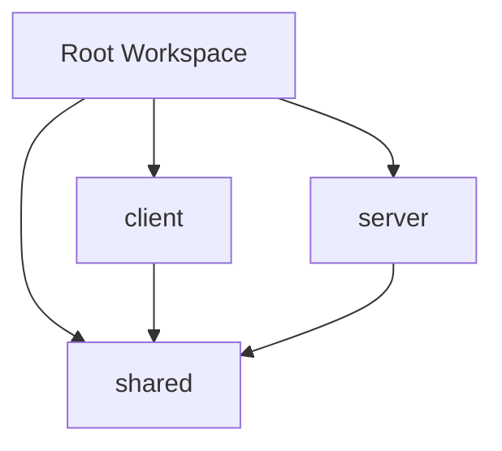

# 技術仕様書

## 概要

この技術仕様書は「doc/requirements.md」で定義されたリアルタイム投票サービスの技術実装方針を記述します。

## 1. 技術スタック選択理由

### Runtime & Package Manager
**Bun**
- 高速なJavaScript runtime（Node.jsより高速）
- 内蔵パッケージマネージャー
- TypeScript ネイティブサポート
- WebSocket サポート
- リアルタイム通信に最適

### Backend Framework
**Hono**
- 軽量・高速なWebフレームワーク
- TypeScript ファーストの設計
- 豊富なミドルウェア生態系
- WebSocket アップグレード対応
- 投票APIの実装に適している

### Frontend Framework
**React 19**
- 最新のConcurrent Features
- リアルタイムUI更新に最適
- 豊富な生態系
- TypeScript優秀なサポート

**Vite**
- 高速な開発サーバー
- 効率的なバンドル
- HMR（Hot Module Replacement）
- TypeScript & React最適化

### UI Framework
**TailwindCSS + shadcn/ui**
- ユーティリティファーストCSS
- 高品質なコンポーネント
- アクセシビリティ対応（要件6対応）
- カスタマイズ性

## 2. プロジェクト構成

### Monorepo構成
```
bhvr-ws/
├── client/          # React frontend
├── server/          # Hono backend  
├── shared/          # 共通型定義
├── doc/             # 設計書
└── package.json     # Workspace設定
```

### パッケージ依存関係


### 型安全性の確保
- 全パッケージでStrict TypeScript
- 共有型による型安全なAPI通信
- Path aliasによる明確な依存関係

## 3. 要件対応アーキテクチャ

### 要件 1: 投票作成機能
```typescript
// 投票作成API実装
class PollController {
  async createPoll(request: CreatePollRequest): Promise<ApiResponse<Poll>> {
    // バリデーション
    if (!request.title || request.title.trim().length === 0) {
      return {
        success: false,
        error: {
          code: 'VALIDATION_ERROR',
          message: '質問文は必須です'
        }
      };
    }
    
    if (!request.options || request.options.length < 2) {
      return {
        success: false,
        error: {
          code: 'VALIDATION_ERROR', 
          message: '選択肢は最低2個必要です'
        }
      };
    }
    
    // 投票作成
    const poll = await this.pollService.createPoll(request);
    return { success: true, data: poll };
  }
}
```

### 要件 2: 投票参加機能
```typescript
// 重複投票防止機能
class VoteService {
  private votes = new Map<string, Set<string>>(); // pollId -> voterIds
  
  async vote(pollId: string, optionId: string, voterId: string): Promise<boolean> {
    const pollVoters = this.votes.get(pollId) || new Set();
    
    // 重複投票チェック
    if (pollVoters.has(voterId)) {
      throw new Error('ALREADY_VOTED');
    }
    
    // 投票記録
    pollVoters.add(voterId);
    this.votes.set(pollId, pollVoters);
    
    return true;
  }
}
```

### 要件 3: リアルタイム結果表示機能
```typescript
// WebSocket実装
class WebSocketHandler {
  private connections = new Map<string, Set<WebSocket>>();
  
  async handleVote(pollId: string, vote: Vote) {
    // 投票処理
    await this.voteService.addVote(vote);
    
    // リアルタイム更新配信
    const updatedPoll = await this.pollService.getPollWithResults(pollId);
    this.broadcastToPoll(pollId, {
      type: 'poll-updated',
      payload: { poll: updatedPoll }
    });
  }
  
  private broadcastToPoll(pollId: string, message: WebSocketMessage) {
    const connections = this.connections.get(pollId) || new Set();
    connections.forEach(ws => {
      if (ws.readyState === WebSocket.OPEN) {
        ws.send(JSON.stringify(message));
      }
    });
  }
}
```

### 要件 4: 投票管理機能
```typescript
// 投票終了機能
class PollAdminController {
  async endPoll(pollId: string, createdBy: string): Promise<ApiResponse<Poll>> {
    const poll = await this.pollService.getPoll(pollId);
    
    // 権限チェック
    if (poll.createdBy !== createdBy) {
      return {
        success: false,
        error: {
          code: 'UNAUTHORIZED',
          message: '投票を終了する権限がありません'
        }
      };
    }
    
    // 投票終了
    const endedPoll = await this.pollService.endPoll(pollId);
    
    // 全クライアントに通知
    this.webSocketHandler.broadcastToPoll(pollId, {
      type: 'poll-ended',
      payload: { poll: endedPoll, reason: 'ADMIN_ENDED' }
    });
    
    return { success: true, data: endedPoll };
  }
}
```

### 要件 5: データ永続化機能
```typescript
// データベース抽象化層
interface IPollRepository {
  create(poll: Poll): Promise<Poll>;
  findById(id: string): Promise<Poll | null>;
  update(id: string, data: Partial<Poll>): Promise<Poll>;
  delete(id: string): Promise<void>;
}

// MVP版: インメモリ実装
class InMemoryPollRepository implements IPollRepository {
  private polls = new Map<string, Poll>();
  
  async create(poll: Poll): Promise<Poll> {
    this.polls.set(poll.id, poll);
    return poll;
  }
  
  async findById(id: string): Promise<Poll | null> {
    return this.polls.get(id) || null;
  }
  
  // サーバー再起動時の復元対応
  async restore(): Promise<void> {
    // 将来のDB実装でデータ復元
    console.log('Restoring poll data...');
  }
}
```

### 要件 6: レスポンシブデザイン
```typescript
// レスポンシブコンポーネント設計
const PollCard: React.FC<PollCardProps> = ({ poll }) => {
  return (
    <div className="
      w-full max-w-md mx-auto
      sm:max-w-lg md:max-w-xl lg:max-w-2xl
      p-4 sm:p-6
      bg-white rounded-lg shadow-md
      hover:shadow-lg transition-shadow
    ">
      <h3 className="text-lg sm:text-xl font-semibold mb-4">
        {poll.title}
      </h3>
      
      <div className="space-y-2 sm:space-y-3">
        {poll.options.map(option => (
          <PollOption 
            key={option.id}
            option={option}
            className="min-h-[44px] touch-target" // タッチ対応
          />
        ))}
      </div>
    </div>
  );
};
```

## 4. パフォーマンス要件

### レスポンス時間目標
| 機能 | 目標値 | 測定方法 |
|------|--------|----------|
| WebSocket接続 | < 1秒 | 接続確立時間 |
| 投票送信 | < 500ms | RTT測定 |
| 結果更新 | < 200ms | UI更新時間 |
| ページロード | < 3秒 | LCP測定 |

### スケーラビリティ
- 同時接続数: 100ユーザー（MVP）
- メモリ使用量: < 512MB  
- CPU使用率: < 70%

### WebSocket最適化
```typescript
// 接続プール管理
class ConnectionPool {
  private connections = new Map<string, WebSocket>();
  private maxConnections = 100;
  
  addConnection(sessionId: string, ws: WebSocket) {
    if (this.connections.size >= this.maxConnections) {
      throw new Error('Max connections reached');
    }
    this.connections.set(sessionId, ws);
  }
  
  // 効率的なブロードキャスト
  broadcast(pollId: string, message: WebSocketMessage) {
    const jsonMessage = JSON.stringify(message);
    
    this.connections.forEach((ws, sessionId) => {
      if (ws.readyState === WebSocket.OPEN) {
        try {
          ws.send(jsonMessage);
        } catch (error) {
          console.error(`Failed to send to ${sessionId}:`, error);
          this.connections.delete(sessionId);
        }
      }
    });
  }
}
```

## 5. データ管理戦略

### MVPデータストア
```typescript
// インメモリーデータストア
class DataStore {
  private polls = new Map<string, Poll>();
  private votes = new Map<string, Vote[]>();
  private pollVoters = new Map<string, Set<string>>();
  
  // 投票結果の効率的な集計
  aggregateResults(pollId: string): PollOption[] {
    const poll = this.polls.get(pollId);
    const votes = this.votes.get(pollId) || [];
    const totalVotes = votes.length;
    
    return poll?.options.map(option => {
      const optionVotes = votes.filter(v => v.optionId === option.id).length;
      return {
        ...option,
        votes: optionVotes,
        percentage: totalVotes > 0 ? (optionVotes / totalVotes) * 100 : 0
      };
    }) || [];
  }
  
  // 重複投票チェック
  hasVoted(pollId: string, voterId: string): boolean {
    const voters = this.pollVoters.get(pollId) || new Set();
    return voters.has(voterId);
  }
}
```

### 将来の永続化戦略
- **Phase 2**: SQLite による軽量な永続化
- **Phase 3**: PostgreSQL + Redis による本格運用

## 6. エラーハンドリング戦略

### エラー分類
1. **バリデーションエラー**: 入力値不正（要件1、2対応）
2. **ビジネスロジックエラー**: 重複投票等（要件2対応）
3. **ネットワークエラー**: WebSocket切断等（要件3対応）
4. **システムエラー**: サーバー内部エラー（要件5対応）

### 統一エラーハンドリング
```typescript
// エラーハンドラー
class ErrorHandler {
  static handleApiError(error: Error): ApiErrorResponse {
    if (error.message === 'ALREADY_VOTED') {
      return {
        success: false,
        error: {
          code: 'ALREADY_VOTED',
          message: '既に投票済みです'
        }
      };
    }
    
    if (error.message === 'POLL_NOT_FOUND') {
      return {
        success: false,
        error: {
          code: 'POLL_NOT_FOUND',
          message: '指定された投票が見つかりません'
        }
      };
    }
    
    return {
      success: false,
      error: {
        code: 'INTERNAL_ERROR',
        message: 'システムエラーが発生しました'
      }
    };
  }
}
```

### フロントエンドエラー処理
```typescript
// React Error Boundary
const VotingErrorBoundary: React.FC<{ children: React.ReactNode }> = ({ 
  children 
}) => {
  const [hasError, setHasError] = useState(false);
  const [error, setError] = useState<Error | null>(null);
  
  useEffect(() => {
    const handleError = (event: ErrorEvent) => {
      setHasError(true);
      setError(new Error(event.message));
    };
    
    window.addEventListener('error', handleError);
    return () => window.removeEventListener('error', handleError);
  }, []);
  
  if (hasError) {
    return (
      <div className="min-h-screen flex items-center justify-center p-4">
        <div className="text-center">
          <h2 className="text-xl font-semibold mb-2">エラーが発生しました</h2>
          <p className="text-gray-600 mb-4">
            ページを再読み込みしてください
          </p>
          <button 
            onClick={() => window.location.reload()}
            className="px-4 py-2 bg-blue-500 text-white rounded hover:bg-blue-600"
          >
            再読み込み
          </button>
        </div>
      </div>
    );
  }
  
  return <>{children}</>;
};
```

## 7. セキュリティ仕様

### 入力値検証
```typescript
// バリデーション実装
const validatePollCreation = (data: CreatePollRequest): ValidationResult => {
  const errors: string[] = [];
  
  // タイトル検証
  if (!data.title?.trim()) {
    errors.push('タイトルは必須です');
  } else if (data.title.length > 200) {
    errors.push('タイトルは200文字以内で入力してください');
  }
  
  // 選択肢検証
  if (!data.options || data.options.length < 2) {
    errors.push('選択肢は最低2個必要です');
  } else if (data.options.length > 10) {
    errors.push('選択肢は最大10個までです');
  }
  
  // HTMLタグ除去
  data.title = sanitizeHtml(data.title);
  data.options = data.options.map(option => sanitizeHtml(option));
  
  return { isValid: errors.length === 0, errors };
};

function sanitizeHtml(input: string): string {
  return input.replace(/<[^>]*>/g, '');
}
```

### WebSocket セキュリティ
- Origin検証
- Rate limiting（10接続/IP）
- セッションベースの認証
- 入力値のサニタイズ

## 8. 監視・ログ設計

### ログレベル
- **DEBUG**: 開発時のデバッグ情報
- **INFO**: 投票作成、投票実行等の操作ログ
- **WARN**: 異常な操作、接続エラー等
- **ERROR**: システムエラー、データベースエラー

### メトリクス収集
```typescript
// パフォーマンスメトリクス
class Metrics {
  private static instance: Metrics;
  private counters = new Map<string, number>();
  
  static getInstance(): Metrics {
    if (!Metrics.instance) {
      Metrics.instance = new Metrics();
    }
    return Metrics.instance;
  }
  
  // 投票関連メトリクス
  recordPollCreation() {
    this.incrementCounter('polls_created');
  }
  
  recordVote() {
    this.incrementCounter('votes_cast');
  }
  
  recordWebSocketConnection() {
    this.incrementCounter('websocket_connections');
  }
  
  private incrementCounter(name: string, value: number = 1) {
    const current = this.counters.get(name) || 0;
    this.counters.set(name, current + value);
  }
  
  getMetrics() {
    return Object.fromEntries(this.counters);
  }
}
```

## 9. 開発・テスト戦略

### テスト構成
- **Unit Tests**: 個別関数・コンポーネント
- **Integration Tests**: API・WebSocket通信
- **E2E Tests**: 投票フロー全体

### テストツール
- **Bun Test**: ユニットテスト（Bunネイティブ）
- **React Testing Library**: コンポーネントテスト
- **Playwright**: E2Eテスト

### 重要テストケース
```typescript
// 投票機能テスト
describe('Voting System', () => {
  test('should prevent duplicate voting', async () => {
    const pollId = 'test-poll';
    const voterId = 'user-123';
    const optionId = 'option-1';
    
    // 1回目の投票
    await voteService.vote(pollId, optionId, voterId);
    
    // 2回目の投票（エラーになるべき）
    await expect(
      voteService.vote(pollId, optionId, voterId)
    ).rejects.toThrow('ALREADY_VOTED');
  });
  
  test('should update results in real-time', async () => {
    const mockWebSocket = new MockWebSocket();
    const handler = new WebSocketHandler();
    
    await handler.handleVote('poll-123', {
      id: 'vote-1',
      pollId: 'poll-123',
      optionId: 'opt-1',
      voterId: 'user-456',
      timestamp: new Date()
    });
    
    expect(mockWebSocket.sentMessages).toContain(
      expect.objectContaining({
        type: 'poll-updated'
      })
    );
  });
});
```

## 10. デプロイメント戦略

### 開発環境
```bash
# 開発サーバー起動
bun run dev           # 全サービス並列起動
bun run dev:client    # フロントエンドのみ
bun run dev:server    # バックエンドのみ
```

### 本番環境（将来）
- **Frontend**: Vercel / Netlify
- **Backend**: Railway / Fly.io  
- **WebSocket**: 専用インスタンス
- **Database**: PostgreSQL + Redis

### 環境変数管理
```typescript
// 環境設定
interface Config {
  PORT: number;
  NODE_ENV: 'development' | 'production';
  CLIENT_URL: string;
  WEBSOCKET_PORT: number;
  DATABASE_URL?: string;
  REDIS_URL?: string;
}

const config: Config = {
  PORT: parseInt(process.env.PORT || '3000'),
  NODE_ENV: process.env.NODE_ENV as Config['NODE_ENV'] || 'development',
  CLIENT_URL: process.env.CLIENT_URL || 'http://localhost:5173',
  WEBSOCKET_PORT: parseInt(process.env.WEBSOCKET_PORT || '3001'),
  DATABASE_URL: process.env.DATABASE_URL,
  REDIS_URL: process.env.REDIS_URL
};

export default config;
```

## 11. マイグレーション計画

### Phase 1 (MVP): インメモリ実装
- 基本的な投票機能
- WebSocketによるリアルタイム更新
- シンプルなUI

### Phase 2: 軽量永続化
- SQLite導入
- データ復元機能
- 基本的な管理機能

### Phase 3: 本格運用
- PostgreSQL + Redis
- 高可用性構成
- スケーラビリティ向上
- 高度な分析機能